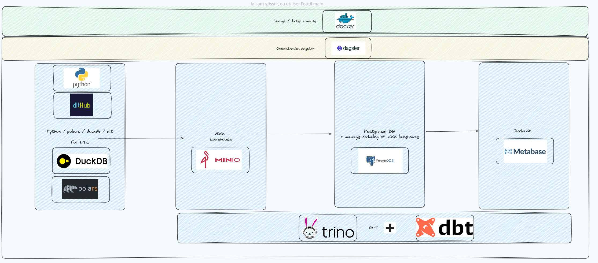

# Modern Data Platform 
This repository contains the setup for a modern data platform leveraging various open-source tools such as Trino, PostgreSQL, MinIO, Metabase,Dagster and more, orchestrated through Docker Compose.
Architecture Overview

## Architecture Overview




## How to Start the Project
Ensure both Docker and Docker Compose are installed on your machine.

To start the entire platform, run:
```bash
docker-compose up -d
```
To stop the platform and remove the containers, run:
```bash
docker-compose down
```

## The platform is designed with the following components:

    ETL (Extract, Transform, Load):
        Uses Python, polars, DuckDB, and dlt for data extraction, transformation, and loading.
        The data is processed and stored in the MinIO lakehouse.

    Lakehouse:
        MinIO serves as an S3-compatible object store, storing raw and processed data.
        PostgreSQL acts as a data warehouse and also manages the metadata catalog for the MinIO lakehouse.

    Query Engine (Trino):
        Trino is used for querying the data from the lakehouse and PostgreSQL, enabling fast and distributed data queries across multiple data sources.

    Data Visualization:
        Metabase connects to the PostgreSQL data warehouse for data visualization and insights.

    Orchestration:
        Dagster handles workflow orchestration, ensuring the ETL processes are run in a timely and reliable manner.


## Debugging the Logs

If you need to debug any of the services, you can use the docker-compose logs command to view the logs of specific services.
View Logs for a Specific Service

To view logs for a particular service (replace <service-name> with the actual service name):


```bash
  docker-compose logs <service-name>
```
For example, to view the logs for the PostgreSQL service:

```bash
docker-compose logs postgres
```
Real-time Logs (Follow Mode)

If you want to follow the logs in real time (similar to tailing logs), use the -f option:
```bash
docker-compose logs -f <service-name>
```


For example, to follow the logs of the trino-coordinator service:

bash

docker-compose logs -f trino-coordinator

### Service Names:

    trino-coordinator
    catalog
    postgres
    pgadmin
    minio
    mc
    metabase


## Architecture

This project is containerized using Docker and orchestrated via Docker Compose. Here is the architecture breakdown:

    Trino: A distributed SQL query engine that interfaces with the MinIO lakehouse and PostgreSQL data warehouse.
    MinIO: An S3-compatible object storage service that stores the lakehouse data.
    PostgreSQL: Serves as the metadata catalog and the data warehouse.
    Metabase: A data visualization tool that connects to PostgreSQL for creating dashboards and visual reports.
    PgAdmin: A PostgreSQL management tool.
    Iceberg Catalog: A REST catalog service for managing MinIO metadata.

## Services

Here’s an overview of the services defined in docker-compose.yml:

    Trino Coordinator:
        Port: 8080
        Manages distributed queries across the MinIO lakehouse and PostgreSQL.

    Iceberg Catalog:
        Port: 8181
        Manages the metadata of the MinIO lakehouse using PostgreSQL as the metadata store.

    PostgreSQL:
        Port: 5431
        Acts as the data warehouse and metadata catalog for the MinIO lakehouse.

    PgAdmin:
        Port: 8888
        A graphical tool for managing and interacting with PostgreSQL.

    MinIO:
        Ports: 9000 (S3), 9001 (Console)
        Provides S3-compatible object storage for the lakehouse.

    Metabase:
        Port: 3000
        A business intelligence tool for visualizing data stored in PostgreSQL.

    MinIO Client (mc):
        Used to set up and configure the MinIO storage buckets.

All the services required for the platform. Depending on your machine, the first startup might take a few minutes as Docker downloads the necessary images.
Accessing the Services

    Trino Web UI:
    Visit http://localhost:8080 to access Trino's web interface.

    PgAdmin:
    Visit http://localhost:8888 to manage your PostgreSQL instance.
        Login: pgadmin@mail.com
        Password: pgadmin123

    MinIO Console:
    Visit http://localhost:9001 to access the MinIO object storage console.
        Login: admin
        Password: password

    Metabase:
    Visit http://localhost:3000 to explore and visualize your data.

Data Storage

    MinIO:
    Data is stored in the MinIO lakehouse. A bucket called warehouse is created automatically for storing data.

    PostgreSQL:
    PostgreSQL is used as the data warehouse and the metadata catalog for the MinIO lakehouse.

Environment Variables

The services share some common environment variables such as AWS_ACCESS_KEY_ID, AWS_SECRET_ACCESS_KEY, and AWS_REGION, which are defined in the docker-compose.yml file.

You can customize these environment variables by updating the x-common-environment section:

yaml

x-common-environment: &common-environment
  AWS_ACCESS_KEY_ID: admin
  AWS_SECRET_ACCESS_KEY: password
  AWS_REGION: us-east-1


Future Improvements:
    
    Integrate ETL
    Integrate Dagster for orchestration of the ETL processes.
    Setup ELT with dbt pipeline
    Set up continuous integration for automatic deployment and testing.
    Add more advanced configurations with Kubernetes for scaling the services as the data grows.